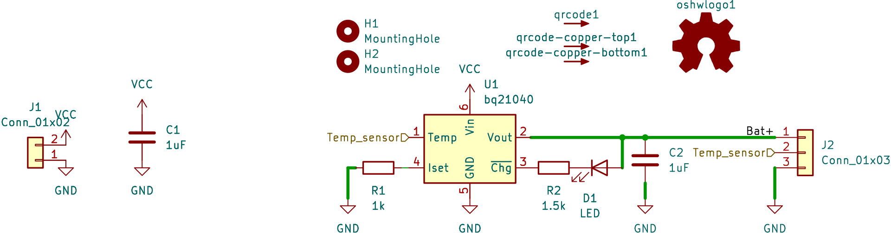

# Minimal LiIon Charger

Based on the TI [bq21040](https://www.ti.com/product/BQ21040).

Thrown together in 15 min. No warranties.

It's about 18 mm × 15 mm. 

## License

(C) 2023 Marcus Müller

[CERN OHL-S v2](https://ohwr.org/cern_ohl_s_v2.txt)

## PCB 3D Render

## Schematic

## BOM

| Ref | Qnty | Value | Cmp name | Footprint | Description | Vendor | DNP |
| --- | --- | --- | --- | --- | --- | --- | --- |
| C1, C2 | 2 | 1uF | C | Capacitor_SMD:C_0805_2012Metric | Unpolarized capacitor |  |  |
| D1 | 1 | LED | LED | LED_SMD:LED_0805_2012Metric | Light emitting diode |  |  |
| H1, H2 | 2 | MountingHole | MountingHole | MountingHole:MountingHole_2.7mm_M2.5 | Mounting Hole without connection |  |  |
| J1 | 1 | Conn_01x02 | Conn_01x02 | Connector_PinSocket_2.54mm:PinSocket_2x01_P2.54mm_Vertical | Generic connector, single row, 01x02, script generated (kicad-library-utils/schlib/autogen/connector/) |  |  |
| J2 | 1 | Conn_01x03 | Conn_01x03 | Connector_PinSocket_2.54mm:PinSocket_1x03_P2.54mm_Vertical | Generic connector, single row, 01x03, script generated (kicad-library-utils/schlib/autogen/connector/) |  |  |
| R1 | 1 | 1k | R | Resistor_SMD:R_0805_2012Metric | Resistor |  |  |
| R2 | 1 | 1.5k | R | Resistor_SMD:R_0805_2012Metric | Resistor |  |  |
| U1 | 1 | bq21040 | bq21040 | Package_TO_SOT_SMD:SOT-23-6 | Voltage and Current Protection for Single-Cell Li-Ion and Li-Polymer Batteries |  |  |
